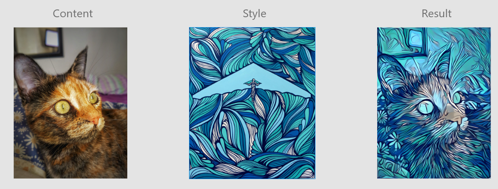
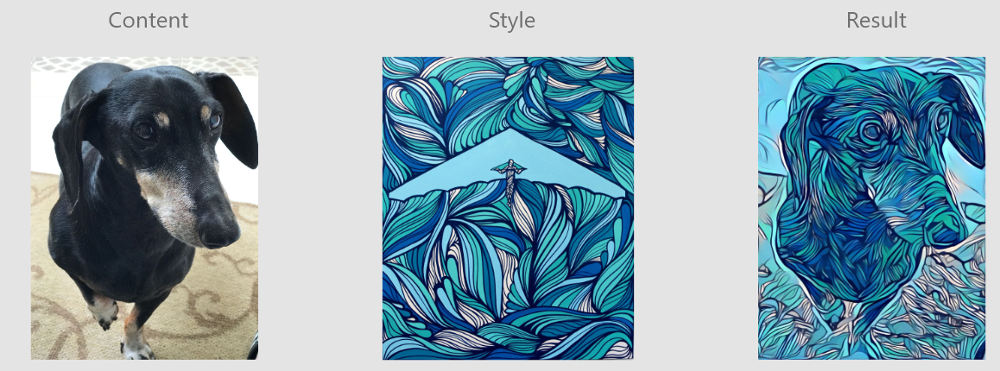
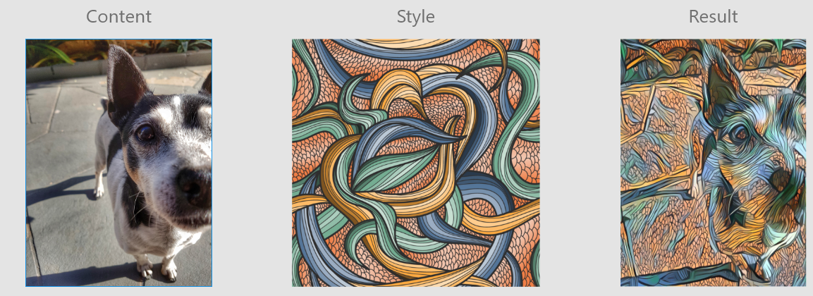

# Style Transfer with Convolutional Neural Network - PyTorch

Style Transfer with Convolutional Neural Network. Part of the Deep Learning Nanodegree of Udacity.

## Script
The python script will train the model and display the results with matplotlib.

## Dependencies

● PyTorch;

● Matplotlib

● Numpy

● PIL

## Results

Left: Content Image   Middle: Style Image   Right: Styled Image

Left: Content Image   Middle: Style Image   Right: Styled Image

Left: Content Image   Middle: Style Image   Right: Styled Image
